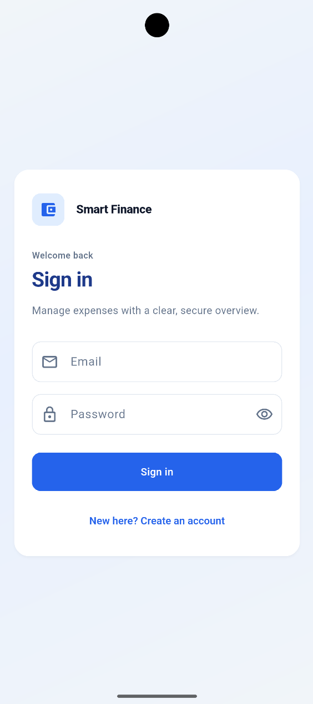
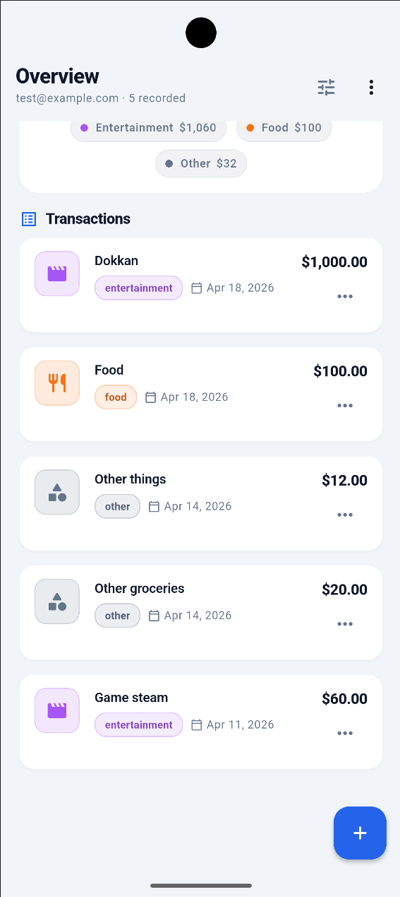

# Smart Finance App

Full-stack personal finance application: **Flutter** mobile client and **Node.js** REST API backed by **PostgreSQL**. Register, sign in, and manage expenses end-to-end.

**Status:** Hardened MVP — reproducible DB schema, session restore, consistent API error handling, and validated backend inputs.

---

## Table of contents

- [Tech stack](#tech-stack)
- [Screenshots](#screenshots)
- [Repository layout](#repository-layout)
- [Features](#features)
- [API overview](#api-overview)
- [Database schema](#database-schema)
- [Environment variables](#environment-variables)
- [Getting started](#getting-started)
- [Roadmap](#roadmap)
- [Author](#author)

---

## Tech stack

| Layer | Details |
|--------|---------|
| **Mobile** | Flutter, Clean Architecture (domain / data / presentation), **Riverpod** (state), **GoRouter** (navigation), **Dio** (HTTP), **flutter_secure_storage** (tokens) |
| **Backend** | Node.js, **Express**, **PostgreSQL** (`pg`), **JWT** auth, **bcrypt**, Helmet, CORS, Morgan |
| **API** | REST, JSON |

---

## Screenshots

| | |
|:--:|:--:|
| *Login* | *Expense list* |
|  |  |

*Placeholder: create `docs/screenshots/` and drop images here, or remove this table until you have assets.*

---

## Repository layout

```
smart-finance-app/
├── backend/
│   ├── db/
│   │   └── schema.sql    # PostgreSQL DDL (users, expenses)
│   └── ...
├── mobile/app/           # Flutter application
└── docs/                 # Documentation and assets (e.g. screenshots)
```

---

## Features

- **Authentication** — Register and login; JWT issued on login; tokens stored securely on device; session restored on cold start.
- **Expenses** — List expenses (with optional query filters); create, update, and delete (authenticated, user-scoped).
- **Architecture** — Separation of domain, data, and presentation layers for maintainability.
- **Health checks** — `GET /health` and `GET /db-test` for server and database connectivity (development/ops).

---

## API overview

Base URL: server host + port (default **5000**). JSON routes are under `/api`.

| Area | Method | Path | Auth |
|------|--------|------|------|
| Health | `GET` | `/health` | No |
| DB check | `GET` | `/db-test` | No |
| Register | `POST` | `/api/auth/register` | No |
| Login | `POST` | `/api/auth/login` | No |
| List expenses | `GET` | `/api/expenses` | Bearer JWT |
| Create expense | `POST` | `/api/expenses` | Bearer JWT |
| Update expense | `PUT` | `/api/expenses/:id` | Bearer JWT |
| Delete expense | `DELETE` | `/api/expenses/:id` | Bearer JWT |

Protected routes expect: `Authorization: Bearer <token>`.

---

## Database schema

Tables **`users`** and **`expenses`** are defined in `backend/db/schema.sql` (indexes, foreign keys, and check constraints). Apply once per database:

```bash
# Example: create DB, then load schema (adjust host/user/db name)
createdb smart_finance
psql -h localhost -U postgres -d smart_finance -f backend/db/schema.sql
```

On Windows, use the same `psql` command from PowerShell or `cmd` if PostgreSQL `bin` is on your `PATH`.

---

## Environment variables

1. Copy `backend/.env.example` to `backend/.env` and edit values (never commit `.env`).
2. The server **exits on startup** if `JWT_SECRET` is missing or shorter than **16 characters** — set a strong secret in every environment.

| Variable | Purpose |
|----------|---------|
| `PORT` | HTTP port (default `5000`) |
| `NODE_ENV` | `development` (default) or `production` (affects logging) |
| `JWT_SECRET` | Secret for signing and verifying JWTs (minimum 16 characters) |
| `DB_HOST` | PostgreSQL host (default `localhost`) |
| `DB_PORT` | PostgreSQL port (default `5432`) |
| `DB_USER` | Database user (default `postgres`) |
| `DB_PASSWORD` | Database password |
| `DB_NAME` | Database name (default `smart_finance`) |

**Mobile:** API base URL is set in `mobile/app/lib/core/constants/app_constants.dart` (default targets Android emulator `http://10.0.2.2:5000`; use `http://localhost:5000` for iOS simulator, or your machine’s LAN IP for a physical device).

---

## Getting started

### Prerequisites

- Node.js and npm  
- PostgreSQL 12+  
- Flutter SDK compatible with `mobile/app/pubspec.yaml`

### 1. Database

Create an empty database and apply `backend/db/schema.sql` (see [Database schema](#database-schema)).

### 2. Backend

```bash
cd backend
npm install
copy .env.example .env   # Windows; on macOS/Linux: cp .env.example .env
# Edit .env: set JWT_SECRET (16+ chars) and DB_* to match your PostgreSQL
npm run dev
```

Verify: open `http://localhost:5000/health` and `http://localhost:5000/db-test` (expect JSON success when DB credentials are correct).

Production-style start: `npm start` (runs `node app.js`).

### 3. Mobile

```bash
cd mobile/app
flutter pub get
flutter run
```

Ensure the backend is running and `app_constants.dart` `baseUrl` matches how the app reaches the API (emulator vs simulator vs device).

---

## Roadmap

- AI-based expense insights  
- Charts and analytics  
- Subscription model  
- Notifications  

---

## Author

**Santiago Castañares**

Portfolio project; under active development.
